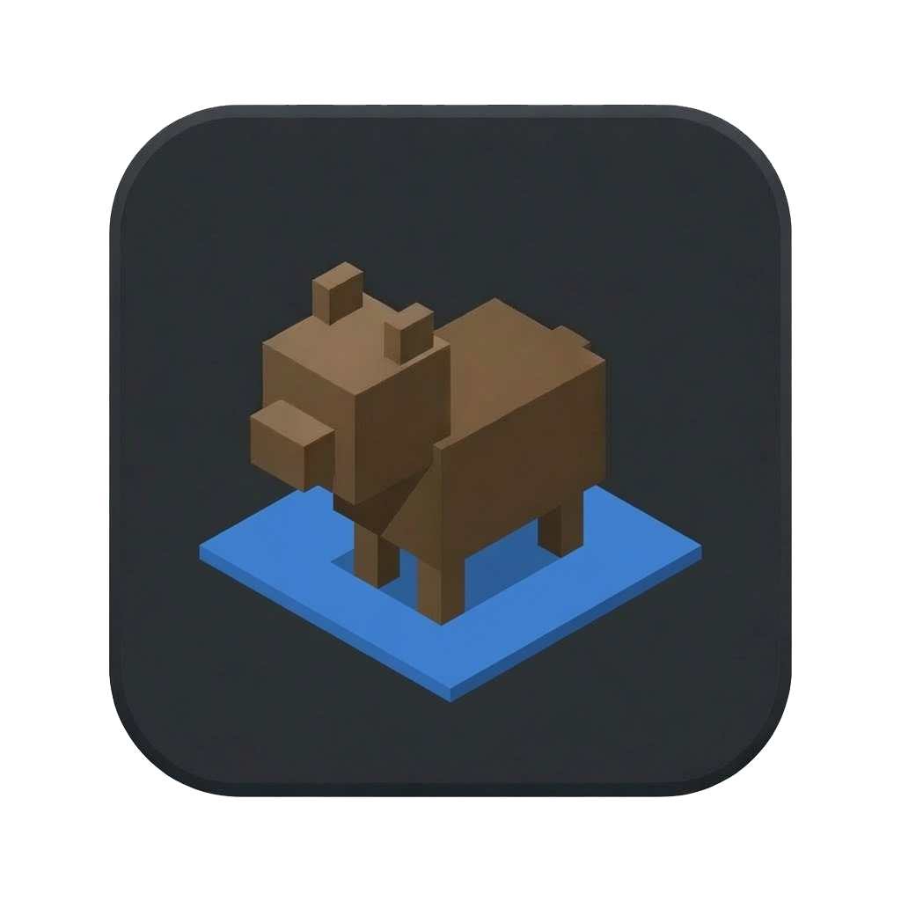

# BearCAD 

<p align="left">
  
</p>

Local-first, parametric CAD. Built by robots.

## Download

| Platform | Download |
|----------|----------|
| macOS (Apple Silicon) | [bearcad.dmg](https://github.com/iffy/BearCAD/releases/latest/download/bearcad.dmg) |
| Windows (x86_64) | [bearcad.exe](https://github.com/iffy/BearCAD/releases/latest/download/bearcad.exe) |
| Linux (x86_64) | [bearcad-linux-x86_64.tar.gz](https://github.com/iffy/BearCAD/releases/latest/download/bearcad-linux-x86_64.tar.gz) |

## Website & docs

The project website and documentation are one [Docusaurus](https://docusaurus.io/) site in
[`docs-site/`](docs-site/). It publishes to
[iffy.github.io/BearCAD](https://iffy.github.io/BearCAD/) via GitHub Pages (see
[`.github/workflows/docs.yml`](.github/workflows/docs.yml)) once Pages is enabled in repo
settings. The site has two parts:

- **Landing page** at the site root (`/`) — hero, download link, and doc entry points.
- **Documentation** under `/docs/` — a tool-by-tool GUI/navigation reference and the Lua
  scripting API.

Build the whole site (landing page + docs together) locally:

```sh
cd docs-site
npm ci            # or: npm install
npm run build     # static output in docs-site/build/ (build/index.html + build/docs/)
```

For a live-reloading dev server while editing:

```sh
cd docs-site && npm run start
```

### Documentation screenshots

The screenshots in the docs are **auto-generated** from Lua scripts in
[`docs-site/screenshots/`](docs-site/screenshots/), so they stay in sync with the app. Each script
builds a small deterministic scene, sets a fixed camera, and captures a PNG via
`bearcad.ui.screenshot(...)`. Regenerate them with:

```sh
scripts/gen-doc-screenshots.sh                              # build + generate all
BEARCAD_SKIP_BUILD=1 scripts/gen-doc-screenshots.sh         # reuse an existing binary
BEARCAD_CARGO_FLAGS="--no-default-features" scripts/gen-doc-screenshots.sh  # lean build
```

The PNGs land in `docs-site/static/img/screenshots/` (served as `/img/screenshots/<name>.png`) and
are git-ignored build artifacts. Capturing needs a real rendered GPU frame, so run this on a machine
with a working display/GPU, or on Linux under `xvfb` + `mesa-vulkan-drivers` (as the Website CI job
does — it regenerates the screenshots and uploads them as a downloadable artifact before deploying).
See [Auto-generated screenshots](docs-site/docs/scripting/screenshots.md) for details.

## Status

- **GUI** with a **wgpu**-accelerated 3D viewport (orbit/pan/zoom, view cube, HUD bear).
- **Sketch tools** on construction planes and face-hosted sketches: **rectangle**, **line**,
  and **circle**.
- **Construction geometry**: construction planes, per-edge construction flags, dashed
  construction lines.
- **Dimension constraints** on lines, rectangle edges, and circle diameters; draggable
  dimension labels.
- **Named parameters** with unit expressions (`mm`, `in`, arithmetic, parameter references).
- **Elements tree**, **Context** pane, **Parameters** table, and **command palette**.
- **Save / Open** documents as `.bearcad` files (SQLite, per SPEC §7).
- **Lua scripts** (SPEC §8): drive the live UI from a `.lua` file.

Not yet implemented: OCCT B-rep kernel, action DAG, assemblies, and the full CLI
from SPEC §9 (`--help` and script mode work today).

## Run

```sh
cargo run
```

- Pick a face with the **Sketch** tool (or start on the default XY construction plane),
  then draw with **Rectangle**, **Line**, or **Circle**.
- Type dimensions while drawing; **Tab** cycles fields; **Enter** commits.
- **Right-drag** to orbit; **Shift+right-drag** to pan; **mouse wheel** to zoom.
- **Escape** cancels an in-progress draw; press again to exit sketch mode or return to
  Select.
- **Save / Save As…** writes a `.bearcad` SQLite file; **Open…** loads one back.
- **Clear** resets the document; **Undo last** reverts the most recent action as a whole
  (e.g. an entire rectangle — its lines and constraints — in one step).

```sh
cargo run -- --help    # usage and exit
cargo test
```

## Building with the OCCT kernel

BearCAD's real BREP geometry kernel is [OpenCASCADE (OCCT)](https://dev.opencascade.org/),
behind the **`occt`** Cargo feature, which is **on by default** — solid
booleans/cut, true BREP fillets/chamfers, and curved-surface STEP all come from the
kernel. So the default `cargo build` / `cargo run` needs a C++ toolchain and a built
OCCT; set that up once:

```sh
# 1. Fetch the pinned OCCT source (once):
git submodule update --init --depth 1 third_party/OCCT

# 2. Build OCCT as static libraries (needs cmake + a C++17 compiler; takes a while):
scripts/build-occt.sh

# 3. Build/run BearCAD (the default build links the kernel):
cargo run
```

`scripts/build-occt.sh` builds the modeling toolkits plus DataExchange (for STEP
read/write) — no visualization, application-framework, or Draw modules — into
`third_party/OCCT/occt-install`, which `build.rs` statically links against.

### Building without the kernel

To build the lean fallback — **no C++ toolchain, no OCCT** — disable the default
feature:

```sh
cargo run --no-default-features
```

This is what the Windows release and the fast CI check build. The kernel-only
features fall back to hand-rolled mesh geometry (or are hidden, e.g. extrude Cut),
but the app is otherwise fully functional.

### Recompiling against a different OCCT version

BearCAD links OCCT **statically**. The LGPL 2.1 permits this on the condition that
you can relink the app against a different (e.g. modified or newer) OCCT. To do
so, point the **`OCCT_DIR`** environment variable at any OCCT install prefix — one
containing `include/opencascade/*.hxx` and `lib/libTK*.a` — and rebuild:

```sh
OCCT_DIR=/path/to/your/occt-install cargo build
```

When `OCCT_DIR` is set it takes precedence over the bundled submodule build, so
you can swap in your own OCCT (from Homebrew, a distro package, or a custom build)
without touching BearCAD's source. See
[`THIRD_PARTY_LICENSES.md`](THIRD_PARTY_LICENSES.md) for the full licensing story.

### Kernel in CI and releases

CI (`.github/workflows/ci.yml`) has a dedicated `occt` job that builds OCCT once
(cached on the pinned submodule + build script, so it's restored rather than
rebuilt on later runs) and runs the kernel test suite, so kernel regressions are
caught on every push/PR. The `ci` job separately builds/tests the
`--no-default-features` (no-kernel fallback) configuration — fast, no OCCT — so
both code paths stay green.

The **macOS and Linux release binaries ship with the kernel** (the default build).
**Windows currently ships the no-kernel fallback build** (`--no-default-features`)
— a static OCCT/MSVC build is being scaffolded via the experimental, non-blocking
`windows-occt` CI job (see issue #96), so on Windows the
kernel-only features (real BREP fillets/chamfers, solid booleans/cut,
curved-surface STEP) fall back to hand-rolled mesh geometry (or are hidden) until
that lands.

## Script quickstart

Scripts are **Lua** files (`.lua`) that call the global `bearcad` API. They drive the same
actions and synthetic input as the GUI, which makes them useful for automation and
regression tests.

**Run a script and quit when it finishes:**

```sh
cargo run -- --script examples/rectangle.lua --exit
# same thing:
cargo run -- examples/rectangle.lua --exit
```

**Interactive REPL** — drive the live app from your terminal, entry by entry:

```sh
cargo run -- --repl
```

```
bearcad> x = 15
bearcad> bearcad.rect{ width = x * 2, height = x }
bearcad> 1 + 2
3
bearcad> bearcad.save("drawing.bearcad")
```

The GUI stays fully interactive while the REPL runs — each entry executes against the
live document, so you can mix typing commands with using the mouse. Globals persist
between entries (like the standalone `lua` REPL), bare expressions echo their value,
errors print and the session continues, multi-line constructs (an unclosed `function`,
etc.) get a `...>` continuation prompt, and **Ctrl-D** ends the session (with `--exit`
it also closes the app).

**Minimal script** — the primary API is *declarative* (OpenSCAD-style): describe geometry
directly instead of simulating clicks. An 80×50 mm rectangle is a single call:

```lua
bearcad.new()
-- Enters a ground-plane sketch if none is open, then makes the rectangle.
bearcad.rect{ width = 80, height = 50, name = "Main box" }
```

**GUI/UI manipulation** (simulated mouse/keyboard, camera, tools, panes) lives under the
`bearcad.ui.*` sub-namespace, kept separate so scripts can focus on modeling. Prefer the
declarative API; reach for `bearcad.ui.*` only when the UI interaction is the point:

```lua
bearcad.ui.tool("rectangle")
bearcad.ui.click_ground(0, 0)     -- millimetres on the active sketch plane
bearcad.ui.move_ground(80, 50)
bearcad.ui.view("front")          -- bearcad.ui.click(x, y) uses viewport pixels instead
```

**Named elements** — set a name when creating geometry or after committing a sketch shape,
then look it up later:

```lua
-- Programmatic create with name:
bearcad.begin_sketch("construction_plane", 0)
bearcad.rect({ width = 80, height = 50, name = "Main box" })

-- Or name after interactive draw:
bearcad.set_name(bearcad.element("rect", 0), "Main box")
local box = bearcad.find("Main box")
bearcad.select(box)
```

More examples: [examples/rectangle.lua](examples/rectangle.lua),
[examples/line.lua](examples/line.lua).

The Lua bindings live in `src/lua_script.rs`; the internal instruction runner is in
`src/script.rs`.

## Lua API reference

Declarative modeling/document functions are on the global `bearcad` table; GUI/UI
manipulation lives under `bearcad.ui.*` (see "Camera, UI, and input" below). Call
`bearcad.import()` once at the top of a script to copy the top-level modeling functions into
the global namespace, so you can write `new()` instead of `bearcad.new()` (the `bearcad.ui.*`
functions stay namespaced). You can also bind individual functions with `local new, rect =
bearcad.new, bearcad.rect`.

Scripts run in a coroutine; calls that need to wait (`bearcad.ui.wait`, `bearcad.ui.wait_ms`,
`bearcad.ui.screenshot`, camera `bearcad.ui.view` commands) yield until the next frame.

### Document

| Function | Description |
|---|---|
| `bearcad.new()` | New empty document |
| `bearcad.open(path)` | Open a document (no file dialog) |
| `bearcad.save()` / `bearcad.save(path)` | Save / Save As |
| `bearcad.clear()` | Reset the document |
| `bearcad.undo()` | Undo the last committed shape |
| `bearcad.quit()` | Close the app when the script ends |

### Reading state back (introspection)

Pure reads of the live document — they never appear in recorded scripts. Together with
`bearcad.sketch_dof()`/`bearcad.sketch_conflicts()` they let a script assert what it built.

| Function | Description |
|---|---|
| `bearcad.count("line")` | Non-deleted entity count (`line`, `circle`, `sketch`, `constraint`, `construction_plane`, `extrusion`, `body`, `parameter`) |
| `bearcad.get{ kind="line", index=0 }` | Table of the entity's fields (`x0/y0/x1/y1`, `length`, `name`, …), or `nil` if out of range/deleted |
| `bearcad.body_stats(0)` | `{ volume, triangles, bbox = { min = {x,y,z}, max = {x,y,z} } }` for a body's solid mesh, or `nil` |
| `bearcad.status()` | The current status-bar text |
| `bearcad.selection()` | Array of `{ kind, index }` for the current scene selection |
| `bearcad.parameter("get", "A")` | A parameter's evaluated value (mm/radians), or `nil` |
| `bearcad.parameter("get_expression", "A")` | A parameter's raw expression string, or `nil` |

### Tools and sketching

| Function | Description |
|---|---|
| `bearcad.ui.tool("rectangle")` | Select a tool (`select`, `line`, `circle`, `sketch`, …) — UI |
| `bearcad.begin_sketch("construction_plane", 0)` | Start sketching on a face |
| `bearcad.open_sketch(0)` | Re-open an existing sketch |
| `bearcad.exit_sketch()` | Leave the active sketch |

### Elements and names

| Function | Description |
|---|---|
| `bearcad.element("rect", 0)` | Reference an element by kind and index |
| `bearcad.find("Name")` | Look up an element by custom name (or `nil`) |
| `bearcad.set_name(element, "Name")` | Set or rename an element |
| `bearcad.select(element)` | Select an element (`{ additive = true }` to add) |
| `bearcad.clear_selection()` | Clear scene selection |
| `bearcad.set_visible(element, "hide")` | Show / hide / toggle visibility |
| `bearcad.set_construction(element, true)` | Mark element or edge as construction |
| `bearcad.rect({ width=80, height=50, name="Box" })` | Create a rectangle (optional `name`) |
| `bearcad.line({ length=80, name="Guide" })` | Create a line (optional `name`) |
| `bearcad.circle({ r=12, name="Hole" })` | Create a circle (`r`, its alias `radius`, or `diameter`) |

Element kinds: `construction_plane`, `sketch`, `rect`, `line`, `circle`, `constraint`.
Pass a table `{ kind = "rect", index = 0, edge = "bottom" }` when an edge is needed.

### Dimensions and constraints

| Function | Description |
|---|---|
| `bearcad.set_dim("width", "80")` | Set a dimension while drawing |
| `bearcad.ui.focus_dim("length")` | Focus a dimension field — UI |
| `bearcad.edit_dim("width")` / `bearcad.commit_dim()` | Edit a committed dimension label |
| `bearcad.add_constraint({ kind="line", index=0 }, "25mm")` | Add a distance constraint |
| `bearcad.add_geometric_constraint("parallel")` | Add a geometric constraint |
| `bearcad.drag_vertex({ kind="line", index=0, end="end" }, u, v)` | Drag a point to a sketch-local spot |
| `bearcad.drag_vertex{ point = {...}, du = 5, dv = 3 }` | Nudge a point by a delta (constraint-checked) |
| `bearcad.drag_line({ kind="line", index=0 }, au, av, u, v)` | Drag a line segment |
| `bearcad.drag_line{ line = {...}, du = 0, dv = 4 }` | Translate a line by a delta |

### Parameters

| Function | Description |
|---|---|
| `bearcad.parameter("add", "A", "5mm")` | Add a named parameter |
| `bearcad.parameter("value", 0, "A + 5in")` | Set a parameter expression |
| `bearcad.parameter("name", 0, "Len")` | Rename a parameter |
| `bearcad.parameter("delete", 1)` | Delete a parameter |

### Camera, UI, and input (`bearcad.ui.*`)

All GUI/UI manipulation is under the `bearcad.ui` sub-namespace.

| Function | Description |
|---|---|
| `bearcad.ui.orbit(dx, dy)` / `bearcad.ui.pan(dx, dy)` | Camera motion |
| `bearcad.ui.wheel(scroll)` | Mouse wheel zoom |
| `bearcad.ui.view("front")` | Standard view (waits for animation) |
| `bearcad.ui.view("edge", "front_top")` | View-cube edge |
| `bearcad.ui.view_home()` | Return to home view |
| `bearcad.ui.camera{}` | Read the pose: `{ yaw, pitch, distance, target = {x,y,z}, projection }` |
| `bearcad.ui.camera{ yaw=1.0, distance=200 }` | Set any subset of the pose instantly (no animation) |
| `bearcad.ui.zoom_fit()` | Frame the whole document (bodies + sketch geometry) instantly |
| `bearcad.ui.elements_view("graph")` | Elements-pane layout: `list`, `tree`, or `graph` |
| `bearcad.ui.pane("hierarchy", "hide")` | Show / hide / toggle a pane |
| `bearcad.ui.palette("run", "view top")` | Run a palette command |
| `bearcad.ui.click(x, y)` / `bearcad.ui.move(x, y)` | Synthetic viewport input |
| `bearcad.ui.click_ground(x, y)` | Click on sketch plane (mm) |
| `bearcad.ui.key("enter")` / `bearcad.ui.type("12.5")` | Keyboard / text input |
| `bearcad.ui.wait(5)` | Wait 5 UI frames |
| `bearcad.ui.wait_ms(100)` | Wait 100 milliseconds |
| `bearcad.ui.screenshot("out.png")` | Capture the viewport |

Use `cargo run -- --show-commands` to echo GUI actions as `bearcad.*` calls on stdout.